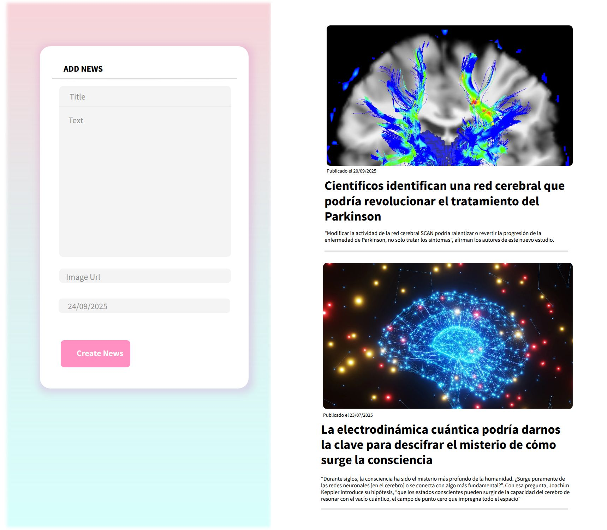

# UNIR_FULLSTACKDEVELOPER_ACTIVIDAD_5
Módulo 3. Framework de Front End Angular. - Actividad:5: Sistema Blogging en Angular.

## 1. Creación del proyecto
Comando para crear un proyecto en Angular:
```bash
ng new BloggingSystem

```

## 2. Creación del componente blog y cargarlo dentro de la aplicación principal

Comando para crear el componente blog:
```bash
ng generate component components/blog --skip-tests
```

Comando para ejecutar el servidor y verificar que el componente se ha cargado en la aplicación principal:

```bash
ng serve -o
```
### 3. Maquetar las áreas dentro del componente con html y css

Primero de todo he creado un diseño con "Penopot" para tener un diseño principal y poder maquetar de una forma más eficiente.

